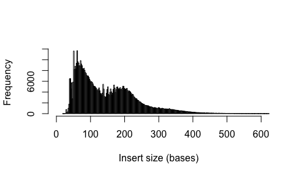
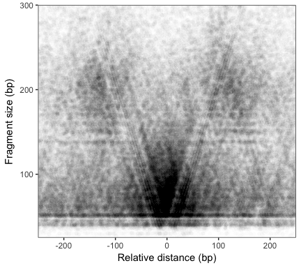

RunATAC
================
Sam Buckberry
2016-11-21

RunATAC
-------

An R package for processing and plotting ATAC-seq data
------------------------------------------------------

This package is currently is it's infantcy. Don't expect any real functionality for a while...

### Install and load the package

``` r
library(devtools)
devtools::install_github("SamBuckberry/RunATAC")
```

### Plot ATAC-seq insert size histogram

First, load a BAM file. Here we will use a BAM file included in the RunATAC package. This BAM is from ATAC-seq on Saccharomyces cerevisiae and includes data only from chrIV.

``` r
library(RunATAC)
bam_fl <- system.file("extdata", "chrIV.bam", package = "RunATAC")
frags <- read_atac_frags(bam_file = bam_fl)
```

Plot the insert size distribution.

``` r
plot_insert_size(frags, xlim=c(0,600))
```



### Generate a Tn5 insertion site and nucleosome bigwig files

``` r
bam_to_insertions_bw(bam_file = bam_fl, file = "inst/extdata/chrIV.ins.bigwig")
bam_to_centres_bw(bam_file = bam_fl, file = "inst/extdata/chrIV.nuc.bigwig")
```

### Calculate proportion of reads mapped to mitochondrial genome

### Calculate the fraction of Tn5 insetions in peaks (FrIP)

Get the Tn5 insertion points from BAM file into GRanges object

``` r
ins <- read_atac_insertions(bam_fl)
ins
```

Load the peak data in the MACS2 .narrowPeak format

``` r
peak_fl <- system.file("extdata", "chrIV_peaks.narrowPeak", package = "RunATAC")
peaks <- read_bed(peak_fl)
peaks
```

Calculate the fraction of reads in peaks

``` r
library(GenomicRanges)
olaps <- overlapsAny(query = ins, subject = peaks)
FrIP <- sum(olaps) / length(ins)
FrIP
```

### Generate a read counts table for peaks

### Plotting ATAC-seq footprints

In this example, we will plot the Tn5 insertion signal around CTCF motifs in ATAC-seq peaks using a positional weight matrix (PWM).

Get the REB1 motif from the JASPAR database.

``` r
#source("https://bioconductor.org/biocLite.R")
#biocLite("BSgenome.Scerevisiae.UCSC.sacCer3")
library(BSgenome.Scerevisiae.UCSC.sacCer3)
library(JASPAR2016)
library(TFBSTools)
library(magrittr)
reb1 <- getMatrixByName(JASPAR2016, name=c("REB1"))
reb1 <- reb1@profileMatrix
```

Get the positions of motif in peaks.

``` r
motif_pos <- motif_gr(gr = peaks, pwm = reb1, genome = Scerevisiae)
motif_pos
```

Get the insertion data for the motif regions

``` r
ins_bw <- system.file("extdata", "chrIV.ins.bigwig", package = "RunATAC")
dat <- range_summary(bigwig = ins_bw, gr = motif_pos)

library(reshape2)
library(dplyr)
library(ggplot2)
mdat <- melt(dat)
fp <- mdat %>% group_by(variable) %>%
                        summarise(yy=mean(value))
fp$variable <- as.character(fp$variable) %>% as.numeric()


gg <- ggplot(fp, aes(x = variable, y = yy, fill = 'blue', title="")) +
                #stat_smooth(span = 10) +
                #geom_area(aes(fill = 'blue', stat = "bin")) +
                geom_line(size=0.3) +
                xlab("Distance from motif") +
                ylab("Tn5 insertions") +
                ggtitle(title) +
                theme_bw() +
                theme(plot.background = element_blank(),
                      panel.border = element_blank(),
                      strip.background = element_rect(size = 0),
                      panel.grid.minor = element_blank(),
                      axis.line = element_line(),
                      axis.text = element_text(size=8))
gg
```

Generate V-plot for motif regions

``` r
plot_v(frags, motif_pos, alpha = 0.01)
```



Calculate bias track
